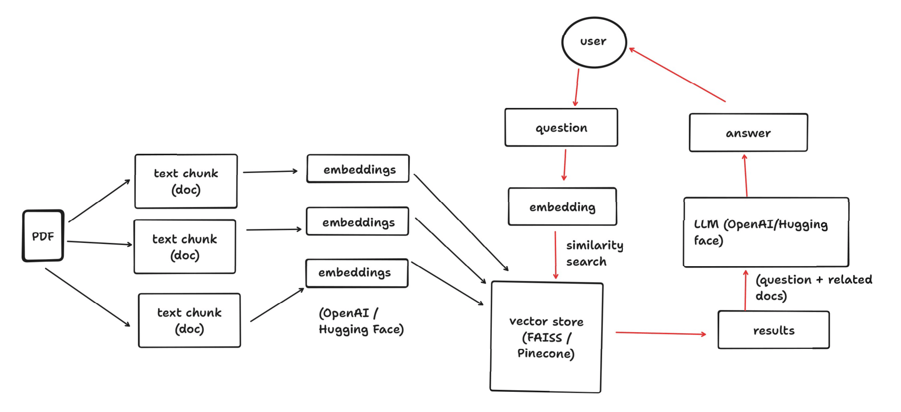

# PDFConverse

Upload your PDF and talk to it in natural language to gain insights and knowledge, just as you would talk to an LLM such as ChatGPT or Bard. 

Note: The app will only respond to questions related to the loaded PDF.

<br>

## How It Works



1. PDF is divided up into small chunks
2. Chunks are embedded using an embedding model
3. Embeddings are stored in a vector store
4. User asks a question
5. Question is embedded using the same embedding model
6. Similarity search of the embedded question is performed with docs in the vector store
7. Question + similar docs are sent to LLM
8. LLM answers the question, which is shown to the user 

<br>

## Setup
This project is written in python `3.10.10`

Copy `.env.example` and rename to `.env` <br>
Add the `OPENAI_API_KEY` to `.env` <br>
To use hugging face models add the `HUGGINGFACEHUB_API_TOKEN` to `.env`

Install requirements:
```
pip install -r requirements.txt
```

In order to use hugging face models, uncomment the following in `requirements.txt`
-  huggingface-hub
- InstructorEmbedding
- sentence-transformers

and run:
```
pip install -r requirements.txt
```


<br>

## Usage

```
streamlit run app.py
```

<br>

To use hugging face models:
```
streamlit run app.py -- --hf
```

Using `--hf` downloads the embedding model on your machine and the embeddings are performed locally. The LLM used is  accessed via the `Hugging Face Inference API`.


<br>

## Demo

